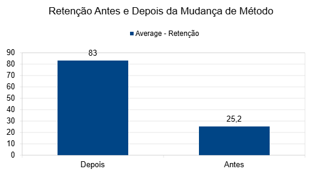
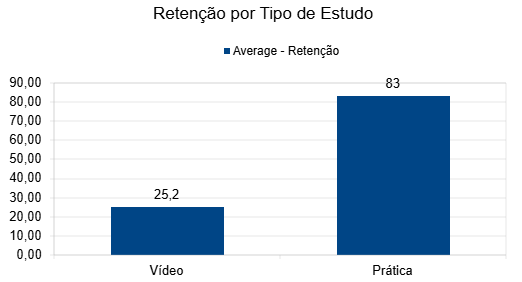
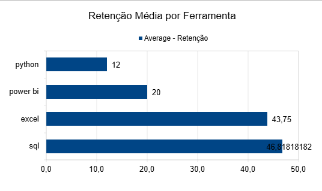
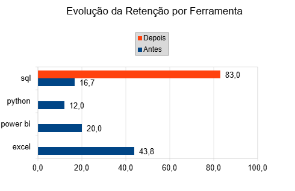

# 📊 De Cursos a Competência — Análise do Aprendizado em Dados

> Apliquei análise de dados no meu próprio processo de aprendizado para identificar padrões de retenção, diagnosticar falhas de estratégia e tomar decisões baseadas em dados.

---

## 🧩 Contexto

Após concluir diversos cursos nas ferramentas Excel, SQL, Python e Power BI, percebi um problema recorrente: **baixa retenção do conteúdo após algumas semanas** e insegurança para aplicar o conhecimento em situações reais.

Minha rotina de estudos era:
- 1 hora por dia, 5 dias por semana
- Consumo majoritariamente passivo (videoaulas)
- Pouca ou nenhuma prática após as aulas
- Estudo simultâneo de múltiplas ferramentas

O volume era alto — mas o retorno, não proporcional.

---

## 🎯 Objetivo da Análise

- Avaliar a retenção de conhecimento ao longo do tempo
- Comparar métodos de estudo (vídeo vs. prática)
- Identificar o impacto do foco em uma única ferramenta
- Entender quais estratégias geram melhor aprendizado

---

## 📁 Estrutura do Repositório

```
📂 analise-aprendizado-dados/
├── 📄 README.md
├── 📊 Base_Analise_Aprendizado_Dados.xls       # Base de dados com registros de estudo
├── 📑 Relatorio_Analise_Aprendizado_Dados.pdf  # Relatório técnico completo
└── 📊 Analise_Aprendizado_Dados_Cassio_Bonfim.pdf     # Apresentação com visualizações
```

---

## 🗃️ Sobre os Dados

Os dados foram coletados a partir da minha própria rotina de estudos e organizados em planilha com as seguintes variáveis:

| Variável | Descrição |
|---|---|
| `Ferramenta` | Tecnologia estudada (Excel, SQL, Python, Power BI) |
| `Tipo de Estudo` | Método utilizado (Vídeo ou Prática) |
| `Período` | Antes ou depois da mudança de estratégia |
| `Retenção` | Escala de 0 a 100 baseada na capacidade de aplicar o conteúdo |

> **Nota:** Os dados são baseados em autoavaliação. A escala de retenção foi estimada com base na capacidade percebida de aplicar o conteúdo estudado. A amostra é pequena, o que é uma limitação reconhecida do estudo.

---

## 🔧 Ferramentas Utilizadas

- **LibreOffice Calc** — estruturação e análise dos dados
- **Tabelas Dinâmicas** — sumarização e comparação entre variáveis
- **Gráficos** — visualização de padrões e insights

---

## 🧭 Abordagem

As ferramentas foram utilizadas de forma intencional e simples, com foco na análise dos dados e na geração de insights, priorizando a clareza e a interpretação dos resultados em vez da complexidade técnica.

---

## 📈 Principais Resultados

### Retenção antes vs depois



> A mudança de estratégia resultou em aumento expressivo na retenção média (de 25,2 para 83,0).

---

### Retenção por método de estudo



> Métodos práticos apresentaram retenção significativamente superior ao estudo passivo, indicando que o método foi o principal fator de melhoria.

---

### Retenção média por ferramenta



> Ferramentas estudadas sem foco apresentaram menor retenção, enquanto o aprofundamento em SQL gerou melhores resultados.

---

### Evolução da retenção por ferramenta



> O SQL apresentou a maior evolução, passando de 16,7 para 83,0 pontos de retenção média após a mudança de estratégia.


> O SQL foi a única ferramenta estudada com foco e método prático no segundo período, o que contribui para a diferença expressiva.

---

## 💡 Principais Insights

1. **O problema estava na estratégia, não na capacidade** — o esforço existia, mas o método não gerava retenção real.
2. **Aprendizado ativo supera consumo passivo** — prática gerou retenção 3x maior que videoaulas.
3. **Foco gera mais resultado que volume** — estudar uma ferramenta com profundidade foi mais eficiente do que estudar várias superficialmente.
4. **Volume de estudo não garante aprendizado efetivo** — horas investidas não se traduzem em retenção sem aplicação prática.
5. **Contexto de aplicação impacta a retenção** — o Excel apresentou retenção elevada mesmo com aprendizado baseado em vídeo, devido ao uso frequente no dia a dia.
---

## 🔄 Mudança de Estratégia

Com base na análise, foram implementadas as seguintes mudanças:

- ✅ Foco em uma única ferramenta (SQL)
- ✅ Aprendizado baseado em prática
- ✅ Redução do consumo passivo de conteúdo
- ✅ Criação de rotina de estudo consistente

---

## 🚀 Aplicação Prática

Este projeto demonstra capacidade de:
- Coleta e estruturação de dados
- Análise exploratória com tabelas dinâmicas
- Identificação de padrões e geração de insights
- Tomada de decisão baseada em dados
- Comunicação clara de resultados

A mesma abordagem analítica aplicada aqui ao processo de aprendizado pode ser usada em **problemas reais de negócio**.

---

## 👤 Autor

**Cassio Bonfim**  
[LinkedIn](https://www.linkedin.com/in/cassiosilva-233b2bb7) • [GitHub](https://github.com/cassiosilva-lab)
